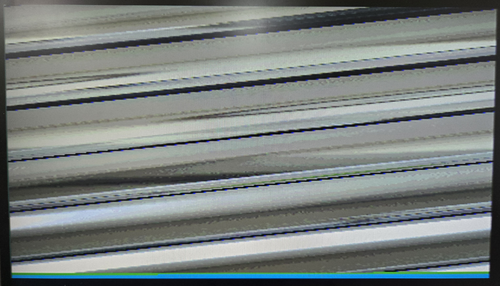

# Troubleshooting: OV7670 사선(Diagonal) 이미지 문제

## 증상

VGA 출력에 이미지가 사선으로 표시됨. 컬러바/실제 영상 모두 동일한 사선 패턴.



## 원인

`OV7670_init_regs.mem`에서 RGB 컬러 포맷 설정 시 COM7 레지스터 값 오류.

```
// 문제 코드
1204    // COM7 = 0x04 (RGB만 설정, QVGA 비트 누락)

// 수정 코드
1214    // COM7 = 0x14 (RGB + QVGA)
```

### COM7 (0x12) 레지스터 비트 구성

```
bit[7] : SCCB Register Reset
bit[5] : Output format - CIF
bit[4] : Output format - QVGA    ← 이 비트가 빠졌음
bit[3] : Output format - QCIF
bit[2] : Output format - RGB
bit[1] : Color bar
bit[0] : Output format - Raw RGB
```

- `0x04` = `0000_0100` → RGB만 설정, **QVGA 해제 → VGA(640x480) 모드로 동작**
- `0x14` = `0001_0100` → RGB + QVGA 설정 → QVGA(320x240) 모드로 동작

### 왜 사선이 되는가

카메라가 VGA(640x480)로 출력하는데 `OV7670_MemController`는 QVGA(320x240) 기준으로 캡처한다.
라인당 픽셀 수와 프레임당 라인 수가 불일치하여 `wAddr`가 매 라인마다 일정한 오프셋으로 밀리면서 사선 패턴이 발생한다.

### 근본 원인: STM32 read-modify-write vs FPGA direct write

STM32 reference 코드(`OV7670_SetColorFormat`)는 COM7을 **read-modify-write**로 설정한다:

```c
OV7670_ReadSCCB(REG_COM7, &temp);
temp &= 0xFA;           // 기존 값 유지하면서 bit2, bit0만 클리어
OV7670_WriteSCCB(REG_COM7, temp | 0x04);  // RGB 비트만 OR
// 결과: 0x11(QVGA) → 0x11 & 0xFA = 0x10 → 0x10 | 0x04 = 0x14
```

FPGA SCCB는 read 기능 없이 **직접 값을 쓰기** 때문에, RES_QVGA에서 설정한 `0x11`(QVGA)이 이후 `0x04`(RGB)로 덮어씌워져 QVGA 비트가 사라졌다.

## 추가 수정 사항

### Frame Control 레지스터 추가

STM32의 `SetFrameControl(168, 24, 12, 492)` 호출에 해당하는 레지스터가 누락되어 있었음.

```
1715    // HSTART = 0x15
1803    // HSTOP  = 0x03
3200    // HREF   = 0x00
1903    // VSTART = 0x03
1A7B    // VSTOP  = 0x7B
0300    // VREF   = 0x00
```

### POWER_ON 딜레이는 불필요

FPGA 컨피그 완료 시점에 XCLK(25MHz)는 이미 안정화되어 있으므로, 별도의 파워온 딜레이 없이도 정상 동작 확인됨. STM32가 150ms 대기한 이유는 PWDN/RST 핀을 직접 제어하는 시퀀스 때문이며, FPGA 환경에서는 해당하지 않음.

## 교훈

SCCB(I2C) write-only 환경에서 OV7670 레지스터를 설정할 때, **한 레지스터에 여러 기능 비트가 있으면 최종 값을 한 번에 써야 한다.** STM32 reference의 read-modify-write 패턴을 그대로 분리된 write로 옮기면 이전 설정이 덮어씌워질 수 있다.
