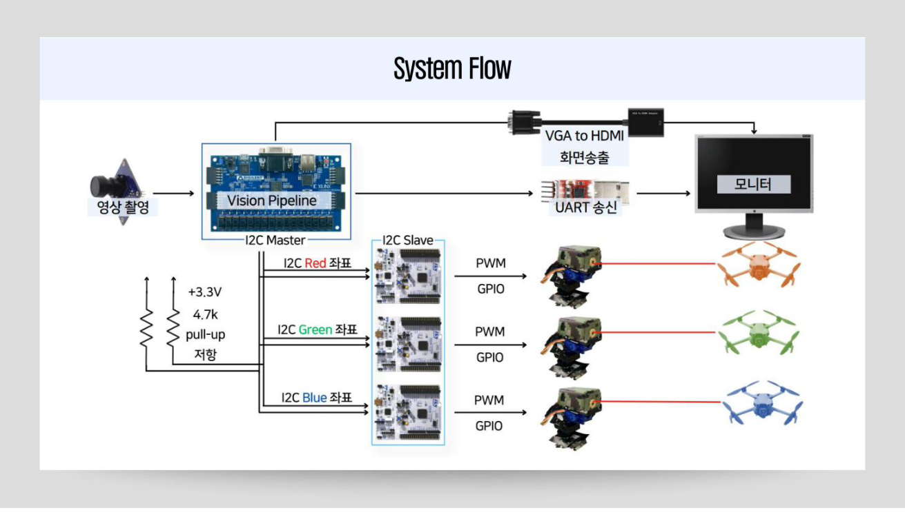
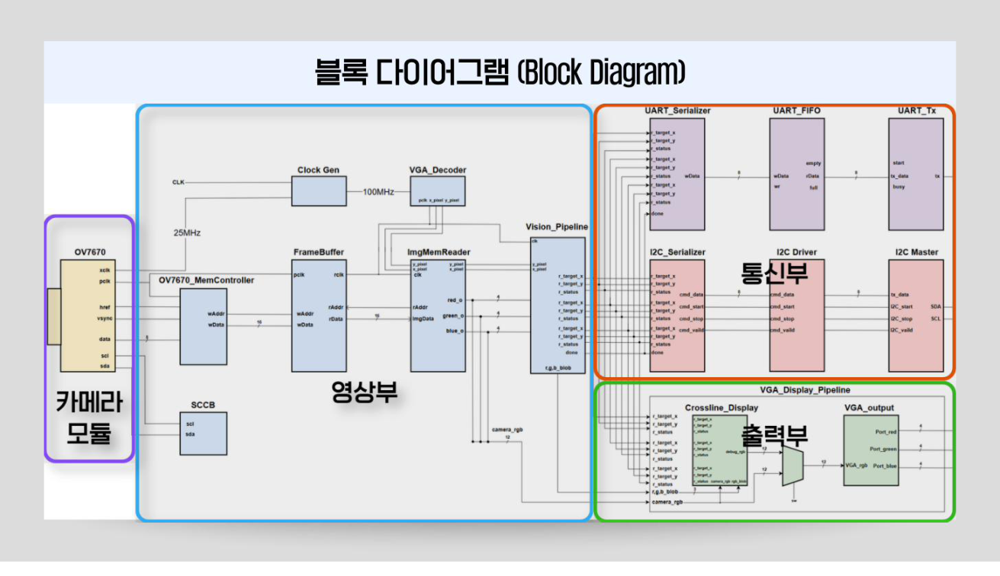
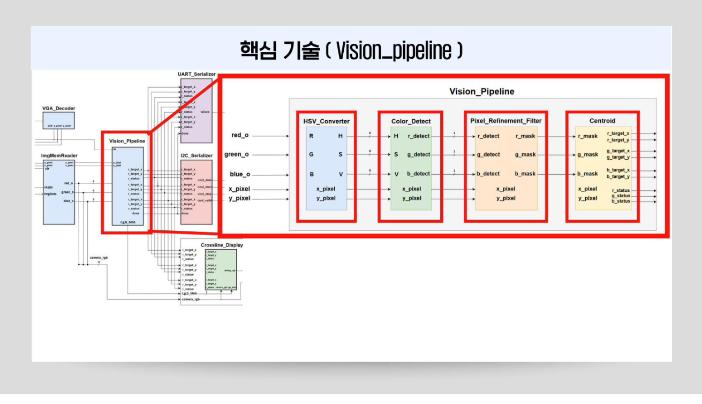
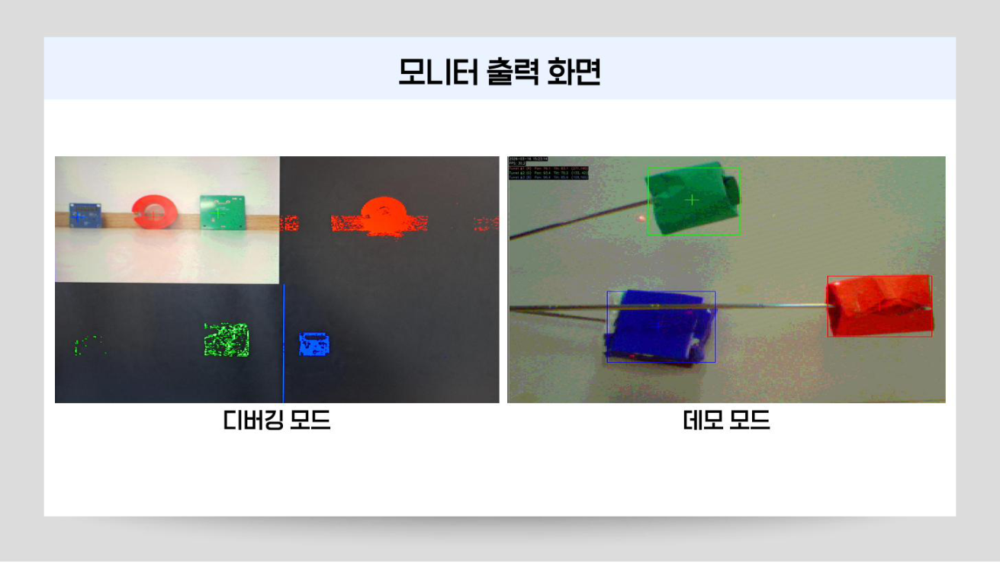

# FPGA 기반 실시간 레이저 트래킹 시스템

OV7670 카메라 영상에서 RGB 3색 타겟을 동시에 인식하고, 각 Pan-Tilt 서보 + 레이저로 자동 조준하는 시스템입니다.  
FPGA Vision Pipeline, STM32 FreeRTOS 펌웨어, I2C/UART 통신을 통합한 임베디드 풀스택 프로젝트입니다.

---

## 데모


> 3개 Pan-Tilt 터렛이 초록색 타겟을 실시간으로 추적하며 레이저를 조준하는 장면.  
> FPGA VGA 출력에서 Bounding Box와 십자선이 실시간 오버레이 됩니다.

---

## 시스템 구조


> OV7670 → FPGA Vision Pipeline → I2C Master → STM32 × 3 (Red / Green / Blue 터렛)  
> 동시에 UART로 PC에 좌표 전송 → OpenCV로 캡처 화면에 텍스트 정보 오버레이


> FPGA 내부 모듈 구성. 카메라부(OV7670 MemController), 영상부(Vision Pipeline), 통신부(UART / I2C), 출력부(VGA Display Pipeline) 4개 서브시스템으로 나뉩니다.

---

## 기술 스택

| 구분 | 내용 |
|------|------|
| FPGA 보드 | Basys3 (Xilinx Artix-7) |
| 카메라 | OV7670 (VGA, ~30fps) |
| MCU | STM32 × 3 |
| RTL | Verilog / SystemVerilog |
| 펌웨어 | C, FreeRTOS |
| 검증 | UVM (SystemVerilog) |
| 툴 | Vivado, Synopsys, STM32CubeIDE |
| 기타 | Python + OpenCV (VGA 캡처 뷰어 + 텍스트 오버레이) |

---

## Vision Pipeline


> ImgMemReader에서 받은 픽셀 데이터가 HSV 변환 → 색상 판별 → 노이즈 제거 → 무게중심 계산 순으로 처리됩니다.

파이프라인은 4단계로 구성됩니다.

**1. HSV Converter**  
카메라 원본은 RGB565 포맷입니다. RGB는 조명 변화에 민감해 색상 분류가 불안정하기 때문에, 색상(H)과 밝기(V)가 분리된 HSV 공간으로 변환합니다.

**2. Color Detect**  
Hue 각도 범위를 지정해 Red / Green / Blue 픽셀을 각각 추출합니다. Saturation ≥ 150, Value > 60 임계값으로 낮은 채도의 노이즈를 걸러냅니다.

**3. Pixel Refinement Filter**  
색상 판별 이후에도 카메라 센서 특성상 고립 노이즈와 객체 내부 홀(hole)이 발생합니다. Erosion으로 고립 픽셀을 제거하고, Dilation 효과로 인접 픽셀 간 연결성을 강화합니다.

**4. Centroid**  
Blob을 구성하는 모든 픽셀 좌표를 합산하고 픽셀 수(N)로 나눠 타겟 중심 좌표 (cx, cy)를 산출합니다.

---

## 통신 구조

### I2C (FPGA → STM32)

FPGA I2C Master가 3개의 STM32 Slave에 각 타겟 좌표를 8바이트 패킷으로 전송합니다.  
패킷은 감지 여부(status), X 좌표 10bit, Y 좌표 10bit로 구성됩니다.

### UART (FPGA → PC)

3개 타겟 좌표 전체를 18바이트 패킷(STX + 채널별 X/Y/Status + Checksum + ETX)으로 PC에 전송합니다.  
PC에서는 Python + OpenCV로 좌표를 수신해 캡처 화면에 Pan/Tilt 각도, FPS 등 텍스트 정보를 오버레이합니다. Bounding Box와 십자선은 FPGA VGA Display Pipeline에서 직접 렌더링됩니다.

### SCCB (FPGA → OV7670)

OV7670 내부 레지스터 초기 설정에 사용하는 2선식 직렬 프로토콜입니다. I2C와 유사하지만 ACK 비트를 판단하지 않습니다.

---

## STM32 FreeRTOS

I2C로 수신한 타겟 좌표를 기반으로 서보 각도를 계산하고, 레이저와 부저를 독립 제어합니다.  
I2C 수신 대기 중에도 서보·레이저·부저가 끊김 없이 동작하도록 태스크 5개를 병렬 실행합니다.

```
DefaultTask  — 버튼 입력 처리 (모드 전환, 레이저 ON/OFF)
Task_Servo   — 서보 모터 PWM 제어 (자동 / 수동 / 영점 모드)
Task_Laser   — 레이저 GPIO 제어
Task_Buzzer  — 타겟 감지 시 부저
Task_I2C     — FPGA로부터 좌표 수신
```

영상 좌표(320×240)를 서보 각도로 변환할 때는 화면 중심과의 오차(err_x, err_y)에 gain을 곱해 pan/tilt 각도를 계산합니다. 터렛마다 카메라 기준점이 달라 gain과 offset을 개별 튜닝했습니다.

---

## 모니터 출력


> 왼쪽: 디버깅 모드 — 4분할로 R/G/B HSV 마스크와 원본 영상을 동시에 확인.  
> 오른쪽: 데모 모드 — FPGA에서 렌더링한 Bounding Box·십자선과 PC에서 오버레이한 FPS·좌표 텍스트가 표시된 최종 출력.

---

## 검증 (SCCB UVM)

SCCB Master 모듈은 UVM Testbench로 기능 검증을 수행했습니다.  
초기 256 transactions에서 corner case(`0x00`, `0xFF`)가 누락되어 Coverage 미달 → transaction 수 증가 + 분포 가중치(constraint distribution) 적용으로 400 transactions 기준 **PERFECT PASS, Coverage 100%** 달성.

---

## 리포지토리 구조

```
.
├── Basys3-Master/                          # Vivado 프로젝트
│   └── Verilaser.srcs/
│       ├── sources_1/new/                  # RTL 소스 (SystemVerilog)
│       │   ├── top_VGA_OV7670.sv           # 최상위 모듈
│       │   ├── OV7670_Init_Controller.sv   # SCCB 초기화
│       │   ├── OV7670_MemController.sv     # 카메라 메모리 제어
│       │   ├── sccb_master.sv              # SCCB Master
│       │   ├── Vision_Pipeline.sv          # 비전 파이프라인 top
│       │   ├── HSV_Converter.sv            # RGB→HSV 변환
│       │   ├── Color_Detect.sv             # 색상 판별
│       │   ├── Blob_Filter.sv              # 노이즈 제거
│       │   ├── Centroid.sv                 # 무게중심 계산
│       │   ├── i2c_master.sv               # I2C Master
│       │   ├── i2c_controller.sv           # I2C 제어
│       │   ├── i2c_driver.sv               # I2C 드라이버
│       │   ├── Serializer_UART.sv          # UART 직렬화
│       │   ├── uart_tx.sv / uart_rx.sv     # UART 송수신
│       │   ├── VGA_Decoder.sv              # VGA 타이밍
│       │   ├── VGA_Display_Pipeline.sv     # VGA 출력 파이프라인
│       │   ├── BBox_Drawer.sv              # Bounding Box 렌더링
│       │   └── ...
│       ├── sim_1/new/                      # 테스트벤치
│       │   ├── tb_OV7670_Init_Controller.sv
│       │   ├── tb_HSV+ColorDetect.sv
│       │   └── tb_uart.sv
│       └── constrs_1/                      # XDC 제약 조건
├── STM32-Slave/                            # STM32 FreeRTOS 펌웨어
│   ├── 260306_servo_razer_control/          # 서보+레이저 초기 제어
│   ├── Verilaser_RTOS/                      # FreeRTOS 기반 최종 펌웨어
│   └── Verilaser_RTOS_LeeJae/              # FreeRTOS 변형 (LeeJae)
├── PC-Monitor/                             # PC 모니터 출력
│   ├── src/capture.py                       # Python + OpenCV VGA 렌더링
│   ├── docs/setup.md
│   └── requirements.txt
├── assets/                                 # README 이미지
└── README.md
```
